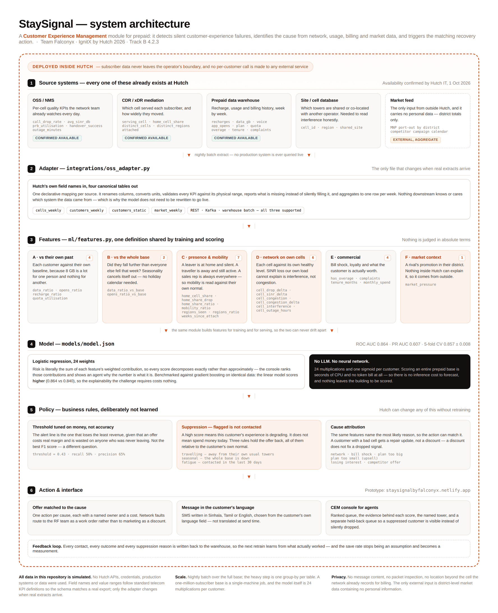

<div align="center">

# StaySignal

### Prepaid customers don't complain before they leave. They go quiet.

**StaySignal is a Customer Experience Management module for prepaid.**
It detects silent customer-experience failures, identifies the cause from network,
usage, billing and market data, and triggers the matching recovery action —
in the customer's own language.

[](https://github.com/projectswyaneth/staysignal)
[](https://github.com/projectswyaneth/staysignal)
[](https://staysignalbyfalconyx.netlify.app)


**Team Falconyx · University of Sri Jayewardenepura**

</div>

---

## The one number

A blanket retention discount is not a cautious choice. On our held-out test set
it is **worse than doing nothing at all**.

| Strategy | Revenue lost over 6 months |
|---|---|
| Contact nobody | Rs. 1,614,006 |
| Contact everybody — the blanket discount | Rs. 2,324,699 |
| **Contact who StaySignal flags** | **Rs. 1,517,559** |

Targeting saves **Rs. 807,139 against blanket discounting** and Rs. 96,447
against doing nothing. That gap is the entire argument for this project, and
everything below exists to make it trustworthy.

> **All data in this repository is simulated.** No Hutch API, credential,
> production system or customer record was used. The pipeline is built so that
> only one adapter file changes when real extracts arrive.

---

## Why a quiet customer is hard

Four people all look identical in the data — usage down, reloads down, app opens down:

| | What's really happening | What the wrong system does |
|---|---|---|
| 🧳 | On holiday in Jaffna for two weeks | Sends a discount to a loyal customer |
| 🎊 | At home for a national holiday, like everyone else | Sends 400,000 discounts in one week |
| 🚗 | A sales rep who uses twelve towers every week, as always | Holds him back as "travelling" — **forever** |
| 🚪 | Actually leaving | Gets missed in the noise |

Telling these four apart is the whole problem. StaySignal does it with one idea,
applied everywhere:

> **Nothing is judged in absolute terms.**
> A customer is compared to their own past. A cell is compared to its own past.
> A week is compared to what the whole base did that week. A traveller is compared
> to their own normal travel.

---

## Architecture



*Full-size source: [`docs/architecture.html`](docs/architecture.html) — editable and re-renderable.*

---

## The four tests that matter

Accuracy is not the headline. These are, because each one is a question a judging
panel actually asked us, turned into a number that either moves or doesn't.
All four are re-run on every training run by [`ml/train.py`](ml/train.py) and
written to [`reports/metrics.md`](reports/metrics.md).

<table>
<tr><th width="25%">Test</th><th width="40%">The question behind it</th><th width="35%">Result</th></tr>

<tr><td><b>1 · The holiday test</b></td>
<td>"What happens when the customer is just on holiday?"</td>
<td>At an equal contact budget of 144, wasted offers fall <b>12 → 0</b>, and real
leavers caught rise <b>81 → 93</b>. Travellers move from the 64th risk percentile
to the 26th.</td></tr>

<tr><td><b>2 · The sales rep test</b></td>
<td>"Some people use the same towers daily. A sales rep uses different towers
every day. Did you consider that?"</td>
<td>We had not. Absolute mobility thresholds labelled <b>88 of 88</b> field
workers "travelling" and held them back every week — including when they really
were leaving. Real leavers silently lost: <b>20 → 0</b>, and genuine travellers
are held slightly <i>more</i> reliably than before, not less.</td></tr>

<tr><td><b>3 · The shared tower test</b></td>
<td>"Those towers are shared with Mobitel and Dialog. Their congestion hurts your
customer. How would you identify that?"</td>
<td>We can't see another operator's traffic — but we can see signal loss
<i>our own load does not explain</i>. Congestion cells: +25.7pp PRB, 3.0 dB lost,
<b>0.0 dB unexplained</b>. Interference cells: +0.6pp PRB, 4.5 dB lost,
<b>4.1 dB unexplained</b>.</td></tr>

<tr><td><b>4 · The competitor test</b></td>
<td>"Dialog's and Mobitel's promotions can hit Hutch churn hard."</td>
<td>Correct, and no internal data can see it. District-level market pressure
(MNP port-outs + public campaign calendar) raises capture of promotion-driven
leavers <b>48% → 52%</b>.</td></tr>
</table>

### How the model got here

| Version | Features | Added because a panel asked | ROC AUC | PR AUC |
|---|---|---|---|---|
| v1 — idea pitch | 4 | — | 0.825 | 0.499 |
| v2 — first technical panel | 18 | network evidence, travel, seasonality | 0.864 | 0.593 |
| **v3 — finalist panel (deployed)** | **24** | own-mobility baseline, interference, competitor pressure | **0.864** | **0.607** |
| Gradient boosting benchmark | 24 | — | 0.840 | 0.556 |

5-fold cross-validation: 0.857 ± 0.008.

**Read that table honestly.** v2 → v3 barely moves AUC, and that is expected: AUC
measures ranking across the whole base, while two of the three faults v3 fixes are
invisible to it — one never reaches the score at all (it's a suppression bug), and
one touches only the 4% of the base a rival's promotion reaches. A version that
improved AUC while leaving those in place would be worse, not better.

The linear model **beats** gradient boosting on this data, so the explainability
the challenge requires costs us nothing. That is measured, not assumed.

---

## Quickstart

```bash
git clone https://github.com/projectswyaneth/staysignal.git
cd staysignal/ml
pip install -r requirements.txt

python generate.py          # four simulated tables: cells, customers, static, market
python generate.py demo     # the smaller set the console runs on
python train.py             # trains v1/v2/v3 + benchmark, runs all four tests
python business_case.py     # break-even sensitivity on every assumption
python build_console_data.py  # rebuilds the console's data file

python ../integrations/oss_adapter.py   # validates the extracts, and proves it
                                        # rejects a broken one
```

Everything regenerates deterministically from fixed seeds, so every number in this
README can be reproduced on any machine in about a minute. The console is a single
static page — open `frontend/index.html`, no build step, no server, no login.

---

## What's in here

```
staysignal/
├── ml/
│   ├── generate.py          simulated OSS + CDR + warehouse + market tables
│   ├── features.py          ★ the 24 features — ONE definition, shared by
│   │                          training and scoring, so they cannot drift apart
│   ├── train.py             trains v1/v2/v3 + GBM, runs the four tests
│   ├── business_case.py     break-even sensitivity on every assumption
│   └── build_console_data.py  builds frontend/data.js from the same features
├── integrations/
│   └── oss_adapter.py       the socket Hutch's real extracts plug into
├── frontend/                the console — static files, no install, no login
├── backend/                 optional scoring API (FastAPI)
├── data/                    generated tables (104,000 customer-weeks)
├── models/model.json        the deployed model: 24 weights, human-readable
├── reports/                 metrics, business case, learned weights
└── docs/                    architecture, integration spec, AI declaration,
                             limitations, implementation plan, business model,
                             judge Q&A, presentation
```

**Start here if you're reviewing this:** [`ml/features.py`](ml/features.py) is where
the thinking lives, and [`reports/metrics.md`](reports/metrics.md) is where the
claims are checked.

---

## How it works

**1 · Detect.** A logistic regression model scores every customer 0–100 on the
chance they go silent in the next 30 days — from 24 features across six families
(own past, whole base, presence and mobility, network experience, commercial,
market context).

**2 · Diagnose.** The same features name the most likely reason: network fault,
bill shock, a package that is too big, a package that is too *small*, losing
interest, or a competitor's offer. The package-too-small case is the one that
makes money rather than saving it — the same detection, pointed at an upsell.

**3 · Decide.** The threshold is tuned on *money*, not accuracy. Then suppression
rules decide whether to actually spend: a customer who is travelling, or who fell
only as far as the whole base fell, or who was contacted last week, is **held back
and shown in a separate queue** rather than silently dropped.

**4 · Act.** Each cause maps to a different action, written as an SMS in Sinhala,
Tamil or English. A customer on a faulty cell gets a repair update and the fault
gets routed to the RF team — *a discount does not fix a dropped signal.*

**5 · Learn.** Every contact, outcome and suppression reason is written back, so the
save rate stops being an assumption and becomes a measurement.

---

## Integration with Hutch

Confirmed with Hutch IT on 1 October 2026. Every source StaySignal needs already
exists:

| What we need | Hutch system | Confirmed |
|---|---|---|
| Per-cell KPIs — drop rate, SINR, PRB utilisation, handover, outages | OSS / NMS | ✅ available |
| Subscriber-to-serving-cell history | CDR / xDR | ✅ available |
| Prepaid recharge and usage history | Data warehouse | ✅ available |
| Integration style | REST, Kafka **or** warehouse batch | ✅ any |
| CEM platform | exists, **but data is not exposed to third-party systems** | ⚠️ constraint |

That last row shaped the design, and we think it's the right constraint: StaySignal
runs **inside Hutch's boundary**. It reads from OSS, CDR and the warehouse — never
from the CEM — and no subscriber record is sent anywhere to be scored. The only
external input is district-level market data, which contains no personal
information at all.

[`integrations/oss_adapter.py`](integrations/oss_adapter.py) is the one file that
changes when real extracts arrive: a declarative mapping from Hutch's own field
names to the four canonical tables, with range validation and an explicit report of
anything missing. Full field-level spec in
[`docs/integration-hutch.md`](docs/integration-hutch.md).

---

## AI usage declaration

| Question | Answer |
|---|---|
| Does the product call an LLM at runtime? | **No.** Not once, for any customer. |
| What model runs in production? | Logistic regression — 24 multiplications and one sigmoid. |
| Inference cost per customer | Effectively zero. No tokens, no API, no per-call billing. |
| Token / cost forecast | **Not applicable.** There is nothing to forecast. |
| Where was AI used? | During development only — Claude (Anthropic) for code review, documentation drafting and critique of our own design, as permitted under section 15 of the delegates' booklet. |
| Can the team explain every decision? | Yes. That is the reason the model is linear and the policy layer is rules. |

Full declaration, including which files were AI-assisted and how each was verified:
[`docs/ai-usage-declaration.md`](docs/ai-usage-declaration.md).

---

## Known limitations

We would rather state these than be asked about them.

- **The data is simulated.** Cell KPIs follow standard telecom definitions and
  realistic ranges, but they are generated. Every number here must be re-run on
  Hutch's own extracts before anyone acts on it.
- **Offer cost and save rate are assumptions**, not measurements. The business case
  therefore reports break-even points rather than a single ROI figure: targeting
  stays ahead of blanket discounting down to a **23.4% save rate** (we assume 35%)
  and up to a **22.5% offer cost** (we assume 15%).
- **Interference is inferred, not measured.** The feature says *our own load does
  not explain this signal loss*. That is a strong hint and a work order for the RF
  team — never proof that a specific neighbouring carrier is responsible.
- **Market pressure needs an external feed.** Without it the feature is zero and the
  model degrades to v2 behaviour on competitor-driven churn.
- **Customers with under ~17 weeks of history cannot be scored** — their own
  baseline window does not exist yet. They are excluded, not guessed at.
- **Causes and suppression rules are business rules, not learned.** Deliberately:
  Hutch must be able to change retention policy without retraining a model.

Expanded, with what we would do about each: [`docs/limitations.md`](docs/limitations.md).

---

## Submission checklist

Everything the IgnitX finalist guidelines require, and where it lives.

| # | Required item | Where |
|---|---|---|
| 1 | Working prototype | [`frontend/`](frontend) · [live console](https://staysignalbyfalconyx.netlify.app) |
| 2 | Source code repository | this repository |
| 3 | README | this file |
| 4 | Solution / technical document | [`docs/technical-document.md`](docs/technical-document.md) |
| 5 | Presentation deck | [`docs/presentation/`](docs/presentation) |
| 6 | Demo video (3–7 min) | [`docs/presentation/`](docs/presentation) |
| 7 | AI usage declaration | [`docs/ai-usage-declaration.md`](docs/ai-usage-declaration.md) |
| 8 | Architecture diagram | [`docs/architecture.png`](docs/architecture.png) |
| 9 | Known limitations | above, and [`docs/limitations.md`](docs/limitations.md) |
| 10 | Hutch integration demonstration | [`docs/integration-hutch.md`](docs/integration-hutch.md) · [`integrations/oss_adapter.py`](integrations/oss_adapter.py) |
| 11 | AI / token / forecast assumptions | [`docs/ai-usage-declaration.md`](docs/ai-usage-declaration.md) — no LLM, nothing to forecast |
| 12 | Implementation plan + Gantt chart | [`docs/implementation-plan.md`](docs/implementation-plan.md) |

Judging-panel questions and our answers, with the evidence for each:
[`docs/judge-questions.md`](docs/judge-questions.md).

---

## Team Falconyx

University of Sri Jayewardenepura · Department of Electronics and Telecommunication

| | |
|---|---|
| **Yaneth De Alwis** | Team lead · model and pipeline |
| **Thamindu Nisal** | Data and integration |
| **Uchitha Samaranayake** | Front end and console |
| **Yohara Perera** | Business case and documentation |
| **Thuvini Mahagamage** | Research and presentation |

---

## Licence

MIT — see [LICENSE](LICENSE). Built for IgnitX by Hutch 2026, Track B,
challenge 4.2.3 *Silent Churn Signal*.
