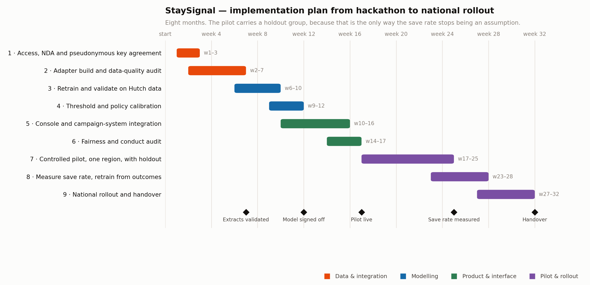

# Implementation plan

Submission item 12. From the end of the hackathon to a national rollout, in nine
phases over eight months.

*Regenerate with `python docs/make_gantt.py`.*

---

## The shape of the plan

Three things drive the ordering, and they are worth stating before the table.

**The pilot carries a holdout group.** Some flagged customers are deliberately
not contacted. This is the only way the save rate — currently our biggest stated
assumption at 35% — becomes a measurement. Everything before phase 7 exists to
make that experiment trustworthy; everything after it exists to act on what it
says.

**Nothing is scored before the extracts are validated.** Phase 2 can fail, and if
it does, phase 3 does not start. A model trained on a silently broken join is
worse than no model, because it is confidently wrong.

**The fairness audit is a gate, not a report.** It sits before the pilot
deliberately. Finding a skew after real customers have been treated differently
is finding it too late.

---

## Phases

| # | Phase | Weeks | Owner | Done when |
|---|---|---|---|---|
| 1 | Access, NDA and pseudonymous key agreement | 1–3 | Hutch IT + team lead | A stable subscriber key exists across OSS, CDR and the warehouse. Nothing identifying is requested. |
| 2 | Adapter build and data-quality audit | 2–7 | Data | `oss_adapter.py` maps Hutch's real field names; the validation report comes back clean on three consecutive nightly extracts. |
| 3 | Retrain and validate on Hutch data | 6–10 | Modelling | All four regression tests re-run on real data, with results written to `reports/`. Numbers will move; the ordering of strategies should not. |
| 4 | Threshold and policy calibration | 9–12 | Modelling + retention team | Hutch's own offer cost and contact-fatigue policy replace our assumptions. The threshold is re-optimised on their economics. |
| 5 | Console and campaign-system integration | 10–16 | Product | Ranked queue and held-back queue reach the people who act on them, in whatever system they already use. |
| 6 | Fairness and conduct audit | 14–17 | Product + compliance | Flag rates reviewed by district and language. Any material skew is explained or removed **before** anyone is contacted. |
| 7 | Controlled pilot, one region, with holdout | 17–25 | Pilot | ~8 weeks of live operation in a single district, with a randomised holdout among flagged customers. |
| 8 | Measure save rate, retrain from outcomes | 23–28 | Modelling | The save rate stops being an assumption. Suppression rules are re-examined against what actually preserved revenue. |
| 9 | National rollout and handover | 27–32 | All | Hutch's own team runs the nightly job, retrains it and changes the policy rules without us. |

### Milestones

| Week | Milestone | What it proves |
|---|---|---|
| 7 | Extracts validated | The data exists, joins, and is physically sane |
| 12 | Model signed off | It works on real data, at Hutch's own economics |
| 17 | Pilot live | Real customers, real offers, a real control group |
| 25 | Save rate measured | The business case rests on a number, not an assumption |
| 32 | Handover | Hutch owns it — the only acceptable end state |

---

## Dependencies and what could go wrong

| Risk | Likelihood | What we do about it |
|---|---|---|
| Data access takes longer than three weeks | **High** — it usually does | Phase 2 is built and unit-tested against the simulator in parallel, so no calendar time is lost waiting |
| A join is broken in a way nobody noticed | Medium | The adapter reports orphaned serving cells explicitly; this is the one failure that is otherwise silent |
| Real churn rate is far from 17% | Medium | The threshold is re-optimised in phase 4 on Hutch's own base; nothing about the method depends on the rate |
| Save rate comes back below 23% | Low–medium | Then targeting does not beat doing nothing, and we say so. The break-even is published up front precisely so this is a finding rather than an embarrassment |
| Retention team cannot absorb a daily queue | Medium | The queue is ranked and the threshold is a volume dial — Hutch sets the contact budget, and the model fills it best-first |
| No market feed available | Low | The feature degrades to zero and the model falls back to v2 behaviour. Nothing breaks |

---

## What we would hand over

- The four canonical tables and the adapter mapping, documented field by field.
- `features.py` — the single definition used by both training and scoring.
- The nightly job, the model file, and the retraining script.
- The policy layer as editable rules, so retention policy changes without a
  model release.
- The four regression tests, so a future change that reintroduces the holiday bug
  or the sales-rep bug fails loudly instead of quietly.

That last point is the one we care about most. The tests are the real deliverable:
they are what stops the next person from making the mistakes this panel caught us
making.

---

## Resourcing

Through the pilot this is a small team — two engineers part-time plus a retention
analyst, with RF-team involvement only when a network case is raised. There is no
GPU, no inference bill and no vendor contract, because the model is 24 weights in
a JSON file and everything runs inside Hutch's own boundary.
